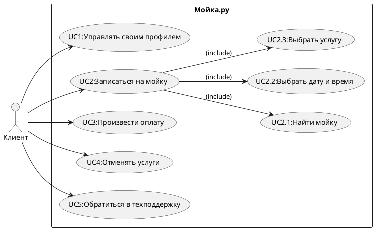

### Проект автомоек

### 1.User Story
1.Я как владелец автомобиля хочу записаться на автомойку онлайн чтобы сэкономить время и не ждать в очереди. <br>
2.Я как водитель такси хочу воспользоваться экспресс-мойкой чтобы автомобиль быстро был чистым и готовым к следующему заказу.<br>
3.Я как клиент автомойки хочу видеть доступные тарифы и услуги на сайте или в приложении чтобы выбрать подходящий вариант.<br>
4.Я как владелец автомобиля хочу получить напоминание о предстоящей записи чтобы не забыть приехать на автомойку вовремя.<br>
5.Я как постоянный клиент автомойки хочу получать скидки и бонусы за регулярные посещения чтобы экономить деньги на услугах мойки.<br>
6.Я как владелец автомобиля хочу заказать антидождевую обработку стекол чтобы улучшить видимость во время дождя и повысить безопасность.<br>
7.Я как клиент автомойки хочу иметь возможность оплатить услугу онлайн чтобы сократить время ожидания на месте.<br>
8.Я как клиент автомойки хочу получить услугу выездной мойки чтобы не тратить время на поездку и получить чистый автомобиль у дома.<br>
9.Я как владелец внедорожника хочу воспользоваться услугой мойки днища автомобиля чтобы защитить его от коррозии и грязи.<br>
10.Я как родитель с маленькими детьми хочу находиться в комфортной зоне ожидания с Wi-Fi и напитками чтобы спокойно дождаться завершения мойки автомобиля.<br>

### 2.Use Case diagram


<details>
  <summary>Код Use Case</summary>
  


</details>

#### Сценарии использования

#### UC1: Управлять своим профилем
Участники:<br>
Клиент<br>

Предусловия:<br>
Клиент зарегистрирован в системе и вошел в аккаунт.<br>

Условие для запуска сценария:<br>
Клиент выбирает опцию управления профилем.<br>

#### Базовый сценарий:<br>
Клиент открывает раздел "Профиль".<br>
Клиент редактирует свои данные (имя, фамилию, email, телефон).<br>
Клиент сохраняет изменения.<br>
Система подтверждает успешное обновление профиля.<br>

#### Альтернативный сценарий:<br>
Клиент вводит некорректные данные (например, невалидный email).<br>
Система выводит сообщение об ошибке и предлагает исправить данные.<br>
Клиент исправляет данные и сохраняет изменения.<br>
Система подтверждает успешное обновление профиля.<br>

Признак успешности:<br>
Профиль клиента успешно обновлен.<br>

#### UC2: Записаться на мойку<br>
Участники:<br>
Клиент<br>

Предусловия:<br>
Клиент зарегистрирован в системе и вошел в аккаунт.<br>

Условие для запуска сценария:<br>
Клиент выбирает опцию записи на мойку.<br>

#### Базовый сценарий:<br>
Клиент выбирает опцию "Записаться на мойку".<br>
Система предлагает найти мойку (UC2.1).<br>
Клиент выбирает дату и время записи (UC2.2).<br>
Клиент выбирает услугу или несколько услуг (UC2.3).<br>
Клиент подтверждает запись.<br>
Система подтверждает успешную запись на мойку.<br>

#### Альтернативный сценарий:<br>
Клиент не может найти подходящую мойку (UC2.1).<br>
Система предлагает клиенту вернуться на главный экран.<br>

Или:<br>

Выбранное время недоступно (UC2.2).<br>
Система предлагает выбрать другое время.<br>
Признак успешности:<br>
Запись на мойку успешно создана.<br>

#### UC3: Произвести оплату<br>
Участники:<br>
Клиент<br>

Предусловия:<br>
Клиент записался на мойку.<br>

Условие для запуска сценария:<br>
Клиент выбирает опцию оплаты услуги.<br>

#### Базовый сценарий:<br>
Клиент открывает раздел оплаты.<br>
Система отображает сумму и доступные способы оплаты.<br>
Клиент выбирает способ оплаты (например, карта или электронный кошелек).<br>
Клиент вводит необходимые данные.<br>
Система подтверждает успешное выполнение платежа.<br>

#### Альтернативный сценарий:<br>
Клиент выбирает способ оплаты, но вводит некорректные данные.<br>
Система выводит сообщение об ошибке.<br>
Клиент вводит корректные данные.<br>
Платеж успешно проводится.<br>

Признак успешности:<br>
Услуга успешно оплачена, подтверждение оплаты отображено.<br>

#### UC4: Отменять услуги<br>
Участники:<br>
Клиент<br>

Предусловия:<br>
Клиент записался на мойку.<br>

Условие для запуска сценария:<br>
Клиент выбирает услугу для отмены.<br>

#### Базовый сценарий:<br>
Клиент открывает раздел "Мои записи".<br>
Клиент выбирает услугу для отмены.<br>
Система спрашивает подтверждение отмены.<br>
Клиент подтверждает отмену.<br>
Система отменяет запись и отправляет уведомление.<br>

#### Альтернативный сценарий:<br>
Клиент открывает раздел "Мои записи".<br>
Система не позволяет отменить запись (например, время уже истекло).<br>
Клиент получает соответствующее уведомление.<br>

Признак успешности:<br>
Услуга успешно отменена, клиент получает уведомление.<br>

#### UC5: Обратиться в техподдержку<br>
Участники:<br>
Клиент<br>

Предусловия:<br>
Клиент зарегистрирован в системе и вошел в аккаунт.<br>

Условие для запуска сценария:<br>
Клиент выбирает опцию обращения в техподдержку.<br>

#### Базовый сценарий:<br>
Клиент открывает раздел "Техподдержка".<br>
Клиент выбирает тему обращения и вводит описание проблемы.<br>
Клиент отправляет запрос.<br>
Система подтверждает успешное создание обращения и присваивает номер запроса.<br>

#### Альтернативный сценарий:<br>
Клиент не указывает обязательные данные (тема обращения или описание).<br>
Система выводит сообщение об ошибке и предлагает заполнить обязательные поля.<br>
Клиент корректирует данные и отправляет запрос.<br>
Система подтверждает успешное создание обращения.<br>

Признак успешности:<br>
Запрос в техподдержку успешно создан.<br>

### 3. ERD


<details>
  <summary>Код ERD</summary>
  
```plaintext

Table Client {
  client_id int [pk]
  first_name varchar
  last_name varchar
  email varchar
  phone varchar
  password varchar
}

Table Profile {
  profile_id int [pk]
  client_id int [ref: > Client.client_id]
  created_at datetime
  updated_at datetime
}

Table CarWash {
  car_wash_id int [pk]
  name varchar
  address varchar
  rating float
  contact_phone varchar
}

Table Service {
  service_id int [pk]
  service_name varchar
  description text
  price decimal
  duration int
}

Table Booking {
  booking_id int [pk]
  client_id int [ref: > Client.client_id]
  car_wash_id int [ref: > CarWash.car_wash_id]
  booking_datetime datetime
  status varchar
  total_price decimal
}

Table SelectedServices {
  booking_id int [ref: > Booking.booking_id]
  service_id int [ref: > Service.service_id]
  quantity int
}

Table Payment {
  payment_id int [pk]
  booking_id int [ref: > Booking.booking_id]
  payment_datetime datetime
  amount decimal
  payment_status varchar
  payment_method varchar
}

Table Support {
  support_id int [pk]
  client_id int [ref: > Client.client_id]
  request_topic varchar
  issue_description text
  created_at datetime
  request_status varchar
}

```

</details>

### 4. C4 Model

#### Level 1: System Context


<details>
  <summary>Код C1</summary>
  
```plaintext

@startuml
!include https://raw.githubusercontent.com/plantuml-stdlib/C4-PlantUML/master/C4_Context.puml

LAYOUT_WITH_LEGEND()

' System Context
System_Boundary(c1, "Автомойка") {

    System(auto_wash, "Автомойка", "Система управления автомойкой", "Управляет бронированиями, услугами, платежами и пользователями")

}

Person(client, "Клиент", "Пользователь, заказывающий услуги автомойки")
Person(admin, "Администратор", "Сотрудник автомойки, управляющий системой")


System_Ext(payment_system, "Платежная система", "Обрабатывает платежи")
System_Ext(notification_system, "Система уведомлений", "Отправляет уведомления пользователям")
System_Ext(accounting_system, "Система учета", "Система финансового учета")
System_Ext(map_system, "Картографическая система", "Предоставляет информацию о местоположении")


Rel(client, auto_wash, "Запись на мойку, просмотр цен, оплата, отслеживание статуса, обращение в техподдержку", "HTTPS")
Rel(admin, auto_wash, "Управление автомойками, услугами, тарифами, расписанием, просмотр отчетов", "HTTPS")

Rel(auto_wash, payment_system, "Обработка платежей", "REST")
Rel(auto_wash, notification_system, "Отправка уведомлений", "REST")
Rel(auto_wash, accounting_system, "Получение данных по прибыли", "REST")
Rel(auto_wash, map_system, "Получение данных о местоположении автомоек", "REST")

@enduml


```

</details>

#### Level 2: Container Diagram


<details>
  <summary>Код C2</summary>
  
```plaintext

@startuml
!include https://raw.githubusercontent.com/plantuml-stdlib/C4-PlantUML/master/C4_Container.puml

LAYOUT_WITH_LEGEND()

' Containers
System_Boundary(c1, "Автомойка") {
    Container(web_app, "Веб-приложение", "Java, Spring Boot", "Предоставляет интерфейс для клиентов и администраторов")
    Container(mobile_app, "Мобильное приложение", "React Native", "Предоставляет интерфейс для клиентов")
    Container(api, "API-сервис", "Java, Spring Boot", "Предоставляет API для веб- и мобильных приложений")
    ContainerDb(db, "База данных", "PostgreSQL", "Хранит данные пользователей, автомоек, бронирований и т.д.")
   Container(notification_service, "Сервис уведомлений", "Node.js", "Отправляет уведомления пользователям")
}

' External Systems
System_Ext(payment_system, "Платежная система", "Сторонняя система для обработки платежей")
System_Ext(accounting_system, "Система учета", "Сторонняя система для финансовой отчетности")
System_Ext(map_system, "Картографическая система", "Сторонняя система для получения информации о местоположении")
'Person
Person(client, "Клиент", "Пользователь, заказывающий услуги автомойки")
Person(admin, "Администратор", "Сотрудник автомойки, управляющий системой")


' Relationships
Rel(client, mobile_app, "Использует для заказа услуг")
Rel(client, web_app, "Использует для заказа услуг и управления профилем")
Rel(admin, web_app, "Использует для управления системой")
Rel(mobile_app, api, "Использует API")
Rel(web_app, api, "Использует API")
Rel(api, db, "Использует для хранения данных", "JDBC")
Rel(api, payment_system, "Использует для обработки платежей", "REST")
Rel(api, notification_service, "Использует для отправки уведомлений", "REST")
Rel(notification_service, notification_system, "Отправка уведомлений", "REST")
Rel(api, accounting_system, "Получает данные для финансовой отчетности", "REST")
Rel(api, map_system, "Получает данные о местоположении автомоек", "REST")
@enduml


```

</details>

### 5. Sequence Diagram


<details>
  <summary>Код Sequence Diagram</summary>
  
```plaintext

@startuml
actor Client
actor Admin
participant "Mobile App" as MobileApp
participant "Web App" as WebApp
participant "API Service" as APIService
database "Database" as Database
participant "Payment System" as PaymentSystem
participant "Notification Service" as NotificationService
participant "Accounting System" as AccountingSystem
participant "Map System" as MapSystem

Client -> MobileApp: Открывает приложение
MobileApp -> APIService: Запрос списка автомоек
APIService -> MapSystem: Получение данных о местоположении автомоек
MapSystem --> APIService: Данные о местоположении
APIService -> Database: Получение списка автомоек
Database --> APIService: Список автомоек
APIService --> MobileApp: Список автомоек

Client -> MobileApp: Выбирает автомойку и услугу
MobileApp -> APIService: Запрос на создание бронирования
APIService -> Database: Сохранение данных бронирования
Database --> APIService: Успешное сохранение
APIService -> PaymentSystem: Инициирование оплаты
PaymentSystem --> APIService: Успешная оплата
APIService -> NotificationService: Отправка уведомления о бронировании
NotificationService --> Client: Уведомление о бронировании

Admin -> WebApp: Открывает панель управления
WebApp -> APIService: Запрос данных о бронированиях
APIService -> Database: Получение данных о бронированиях
Database --> APIService: Данные о бронированиях
APIService --> WebApp: Данные о бронированиях
Admin -> WebApp: Вносит изменения в бронирование
WebApp -> APIService: Обновление данных бронирования
APIService -> Database: Обновление данных
Database --> APIService: Успешное обновление

APIService -> AccountingSystem: Отправка данных для учета
AccountingSystem --> APIService: Подтверждение получения данных
@enduml


```

</details>


### 6. OpenAPI


<details>
  <summary>Код OpenAPI</summary>
  
```plaintext

openapi: 3.0.3
info:
  title: Car Wash  API
  description: API for managing clients, car washes, and services.
  version: 1.0.0
paths:
  /clients:
    get:
      summary: Get all clients
      tags:
        - Clients
      responses:
        '200':
          description: List of clients
          content:
            application/json:
              schema:
                type: array
                items:
                  $ref: '#/components/schemas/Client'
    post:
      summary: Create a new client
      tags:
        - Clients
      requestBody:
        required: true
        content:
          application/json:
            schema:
              $ref: '#/components/schemas/Client'
      responses:
        '201':
          description: Client created
  /clients/{clientId}:
    get:
      summary: Get a client by ID
      tags:
        - Clients
      parameters:
        - name: clientId
          in: path
          required: true
          schema:
            type: integer
      responses:
        '200':
          description: Client details
          content:
            application/json:
              schema:
                $ref: '#/components/schemas/Client'
    put:
      summary: Update a client by ID
      tags:
        - Clients
      parameters:
        - name: clientId
          in: path
          required: true
          schema:
            type: integer
      requestBody:
        required: true
        content:
          application/json:
            schema:
              $ref: '#/components/schemas/Client'
      responses:
        '200':
          description: Client updated
    delete:
      summary: Delete a client by ID
      tags:
        - Clients
      parameters:
        - name: clientId
          in: path
          required: true
          schema:
            type: integer
      responses:
        '204':
          description: Client deleted
  /car-washes:
    get:
      summary: Get all car washes
      tags:
        - Car Washes
      responses:
        '200':
          description: List of car washes
          content:
            application/json:
              schema:
                type: array
                items:
                  $ref: '#/components/schemas/CarWash'
    post:
      summary: Create a new car wash
      tags:
        - Car Washes
      requestBody:
        required: true
        content:
          application/json:
            schema:
              $ref: '#/components/schemas/CarWash'
      responses:
        '201':
          description: Car wash created
  /car-washes/{carWashId}:
    get:
      summary: Get a car wash by ID
      tags:
        - Car Washes
      parameters:
        - name: carWashId
          in: path
          required: true
          schema:
            type: integer
      responses:
        '200':
          description: Car wash details
          content:
            application/json:
              schema:
                $ref: '#/components/schemas/CarWash'
    put:
      summary: Update a car wash by ID
      tags:
        - Car Washes
      parameters:
        - name: carWashId
          in: path
          required: true
          schema:
            type: integer
      requestBody:
        required: true
        content:
          application/json:
            schema:
              $ref: '#/components/schemas/CarWash'
      responses:
        '200':
          description: Car wash updated
    delete:
      summary: Delete a car wash by ID
      tags:
        - Car Washes
      parameters:
        - name: carWashId
          in: path
          required: true
          schema:
            type: integer
      responses:
        '204':
          description: Car wash deleted
  /services:
    get:
      summary: Get all services
      tags:
        - Services
      responses:
        '200':
          description: List of services
          content:
            application/json:
              schema:
                type: array
                items:
                  $ref: '#/components/schemas/Service'
    post:
      summary: Create a new service
      tags:
        - Services
      requestBody:
        required: true
        content:
          application/json:
            schema:
              $ref: '#/components/schemas/Service'
      responses:
        '201':
          description: Service created
  /services/{serviceId}:
    get:
      summary: Get a service by ID
      tags:
        - Services
      parameters:
        - name: serviceId
          in: path
          required: true
          schema:
            type: integer
      responses:
        '200':
          description: Service details
          content:
            application/json:
              schema:
                $ref: '#/components/schemas/Service'
    put:
      summary: Update a service by ID
      tags:
        - Services
      parameters:
        - name: serviceId
          in: path
          required: true
          schema:
            type: integer
      requestBody:
        required: true
        content:
          application/json:
            schema:
              $ref: '#/components/schemas/Service'
      responses:
        '200':
          description: Service updated
    delete:
      summary: Delete a service by ID
      tags:
        - Services
      parameters:
        - name: serviceId
          in: path
          required: true
          schema:
            type: integer
      responses:
        '204':
          description: Service deleted
  /bookings:
    get:
      summary: Get all bookings
      tags:
        - Bookings
      responses:
        '200':
          description: List of bookings
          content:
            application/json:
              schema:
                type: array
                items:
                  $ref: '#/components/schemas/Booking'
    post:
      summary: Create a new booking
      tags:
        - Bookings
      requestBody:
        required: true
        content:
          application/json:
            schema:
              $ref: '#/components/schemas/Booking'
      responses:
        '201':
          description: Booking created
  /bookings/{bookingId}:
    get:
      summary: Get a booking by ID
      tags:
        - Bookings
      parameters:
        - name: bookingId
          in: path
          required: true
          schema:
            type: integer
      responses:
        '200':
          description: Booking details
          content:
            application/json:
              schema:
                $ref: '#/components/schemas/Booking'
    put:
      summary: Update a booking by ID
      tags:
        - Bookings
      parameters:
        - name: bookingId
          in: path
          required: true
          schema:
            type: integer
      requestBody:
        required: true
        content:
          application/json:
            schema:
              $ref: '#/components/schemas/Booking'
      responses:
        '200':
          description: Booking updated
    delete:
      summary: Delete a booking by ID
      tags:
        - Bookings
      parameters:
        - name: bookingId
          in: path
          required: true
          schema:
            type: integer
      responses:
        '204':
          description: Booking deleted
  /payments:
    get:
      summary: Get all payments
      tags:
        - Payments
      responses:
        '200':
          description: List of payments
          content:
            application/json:
              schema:
                type: array
                items:
                  $ref: '#/components/schemas/Payment'
    post:
      summary: Create a new payment
      tags:
        - Payments
      requestBody:
        required: true
        content:
          application/json:
            schema:
              $ref: '#/components/schemas/Payment'
      responses:
        '201':
          description: Payment created
  /payments/{paymentId}:
    get:
      summary: Get a payment by ID
      tags:
        - Payments
      parameters:
        - name: paymentId
          in: path
          required: true
          schema:
            type: integer
      responses:
        '200':
          description: Payment details
          content:
            application/json:
              schema:
                $ref: '#/components/schemas/Payment'
    put:
      summary: Update a payment by ID
      tags:
        - Payments
      parameters:
        - name: paymentId
          in: path
          required: true
          schema:
            type: integer
      requestBody:
        required: true
        content:
          application/json:
            schema:
              $ref: '#/components/schemas/Payment'
      responses:
        '200':
          description: Payment updated
    delete:
      summary: Delete a payment by ID
      tags:
        - Payments
      parameters:
        - name: paymentId
          in: path
          required: true
          schema:
            type: integer
      responses:
        '204':
          description: Payment deleted
  /support:
    get:
      summary: Get all support requests
      tags:
        - Support
      responses:
        '200':
          description: List of support requests
          content:
            application/json:
              schema:
                type: array
                items:
                  $ref: '#/components/schemas/Support'
    post:
      summary: Create a new support request
      tags:
        - Support
      requestBody:
        required: true
        content:
          application/json:
            schema:
              $ref: '#/components/schemas/Support'
      responses:
        '201':
          description: Support request created
  /support/{supportId}:
    get:
      summary: Get a support request by ID
      tags:
        - Support
      parameters:
        - name: supportId
          in: path
          required: true
          schema:
            type: integer
      responses:
        '200':
          description: Support request details
          content:
            application/json:
              schema:
                $ref: '#/components/schemas/Support'
    put:
      summary: Update a support request by ID
      tags:
        - Support
      parameters:
        - name: supportId
          in: path
          required: true
          schema:
            type: integer
      requestBody:
        required: true
        content:
          application/json:
            schema:
              $ref: '#/components/schemas/Support'
      responses:
        '200':
          description: Support request updated
    delete:
      summary: Delete a support request by ID
      tags:
        - Support
      parameters:
        - name: supportId
          in: path
          required: true
          schema:
            type: integer
      responses:
        '204':
          description: Support request deleted
components:
  schemas:
    Client:
      type: object
      properties:
        client_id:
          type: integer
        first_name:
          type: string
        last_name:
          type: string
        email:
          type: string
        phone:
          type: string
        password:
          type: string
    CarWash:
      type: object
      properties:
        car_wash_id:
          type: integer
        name:
          type: string
        address:
          type: string
        rating:
          type: number
          format: float
        contact_phone:
          type: string
    Service:
      type: object
      properties:
        service_id:
          type: integer
        service_name:
          type: string
        description:
          type: string
        price:
          type: number
          format: decimal
        duration:
          type: integer
    Booking:
      type: object
      properties:
        booking_id:
          type: integer
        client_id:
          type: integer
        car_wash_id:
          type: integer
        booking_datetime:
          type: string
          format: date-time
        status:
          type: string
        total_price:
          type: number
          format: decimal
    Payment:
      type: object
      properties:
        payment_id:
          type: integer
        booking_id:
          type: integer
        payment_datetime:
          type: string
          format: date-time
        amount:
          type: number
          format: decimal
        payment_status:
          type: string
        payment_method:
          type: string
    Support:
      type: object
      properties:
        support_id:
          type: integer
        client_id:
          type: integer
        request_topic:
          type: string
        issue_description:
          type: string
        created_at:
          type: string
          format: date-time
        request_status:
          type: string


```

</details>
