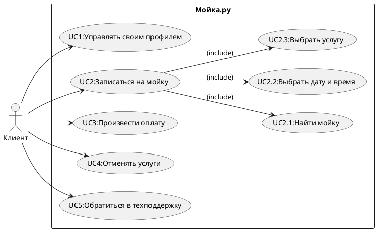

### Проект автомоек

### 1.User Story
1.Я как владелец автомобиля хочу записаться на автомойку онлайн чтобы сэкономить время и не ждать в очереди. <br>
2.Я как водитель такси хочу воспользоваться экспресс-мойкой чтобы автомобиль быстро был чистым и готовым к следующему заказу.<br>
3.Я как клиент автомойки хочу видеть доступные тарифы и услуги на сайте или в приложении чтобы выбрать подходящий вариант.<br>
4.Я как владелец автомобиля хочу получить напоминание о предстоящей записи чтобы не забыть приехать на автомойку вовремя.<br>
5.Я как постоянный клиент автомойки хочу получать скидки и бонусы за регулярные посещения чтобы экономить деньги на услугах мойки.<br>
6.Я как владелец автомобиля хочу заказать антидождевую обработку стекол чтобы улучшить видимость во время дождя и повысить безопасность.<br>
7.Я как клиент автомойки хочу иметь возможность оплатить услугу онлайн чтобы сократить время ожидания на месте.<br>
8.Я как клиент автомойки хочу получить услугу выездной мойки чтобы не тратить время на поездку и получить чистый автомобиль у дома.<br>
9.Я как владелец внедорожника хочу воспользоваться услугой мойки днища автомобиля чтобы защитить его от коррозии и грязи.<br>
10.Я как родитель с маленькими детьми хочу находиться в комфортной зоне ожидания с Wi-Fi и напитками чтобы спокойно дождаться завершения мойки автомобиля.<br>

### 2.Use Case diagram


<details>
  <summary>Код Use Case</summary>
  


</details>

#### Сценарии использования

#### 1. Управлять своим профилем (UC1)  
Участники:
- Клиент  

Предусловия:  
- Клиент зарегистрирован в системе "Мойка.ру".  
- Клиент успешно авторизовался в системе.  

Условие для запуска сценария: 
- Клиент хочет просмотреть или изменить свои личные данные.  

Основной сценарий:  
1. Клиент авторизуется в системе "Мойка.ру".  
2. Система предоставляет доступ к профилю клиента.  
3. Клиент редактирует данные профиля (например, имя, телефон, email или пароль).  
4. Клиент сохраняет изменения.  
5. Система обновляет данные профиля и уведомляет об успешном сохранении.  

Признак успешности:
- Данные профиля клиента успешно обновлены и отображаются в системе.

#### 2. Найти мойку (UC2) 
Участники:  
- Клиент  

Предусловия: 
- Клиент находится на главной странице сервиса "Мойка.ру".  

Условие для запуска сценария:  
- Клиент хочет найти подходящую автомойку по определенным критериям.  

Основной сценарий:
1. Клиент выбирает функцию поиска мойки.  
2. Система предлагает ввести параметры поиска: адрес, тип мойки или услуги.  
3. Клиент вводит параметры поиска.  
4. Система отображает список подходящих моек с краткой информацией.  
5. Клиент выбирает интересующую мойку.  

Признак успешности:  
- Найдена подходящая мойка, и информация о ней отображается клиенту.

#### 3. Выбрать дату и время (UC3)
Участники:  
- Клиент  

Предусловия:  
- Клиент выбрал мойку из предложенного списка.  

Условие для запуска сценария:  
- Клиент хочет записаться на автомойку в удобное время.  

Основной сценарий: 
1. Система отображает календарь свободных слотов для выбранной мойки.  
2. Клиент выбирает удобную дату и время.  
3. Система резервирует выбранный слот и подтверждает бронирование.  

Признак успешности:  
- Выбранная дата и время успешно забронированы.  


#### 4. Выбрать услугу (UC4) 
Участники:  
- Клиент  

Предусловия:  
- Клиент выбрал автомойку и доступное время.  

Условие для запуска сценария:
- Клиент хочет выбрать конкретные услуги на автомойке.  

Основной сценарий:  
1. Система отображает список доступных услуг (например, мойка кузова, химчистка салона).  
2. Клиент выбирает одну или несколько услуг.  
3. Система подтверждает выбор и отображает итоговую стоимость.  

Признак успешности:  
- Услуги выбраны, а стоимость рассчитана и отображена клиенту.

#### 5. Произвести оплату (UC5)  
Участники:  
- Клиент  
- Платежная система  

Предусловия:  
- Клиент выбрал мойку, время и услуги.  

Условие для запуска сценария:  
- Клиент подтверждает намерение оплатить заказ.  

Основной сценарий:  
1. Система "Мойка.ру" передает сумму заказа в платежную систему.  
2. Платежная система запрашивает у клиента данные для оплаты.  
3. Клиент вводит данные и подтверждает платеж.  
4. Платежная система обрабатывает платеж и возвращает статус операции.  
5. Система уведомляет клиента об успешной оплате и подтверждает заказ.  

Признак успешности:  
- Оплата успешно проведена, заказ подтвержден.

#### 6. Отменять услуги (UC6)  
Участники:  
- Клиент  

Предусловия:  
- Клиент уже оформил заказ и услуга не была выполнена.  

Условие для запуска сценария:  
- Клиент хочет отменить заказанную услугу.  

Основной сценарий:  
1. Клиент открывает раздел "Мои записи".  
2. Система отображает список активных заказов.  
3. Клиент выбирает услугу для отмены.  
4. Система запрашивает подтверждение отмены.  
5. Система отменяет услугу и инициирует возврат средств (если применимо).  
6. Клиент получает уведомление об успешной отмене.  

Признак успешности:  
- Услуга отменена, и клиент получил подтверждение.

#### 7. Обратиться в техподдержку (UC7)  
Участники:  
- Клиент  
- Оператор техподдержки  

Предусловия:  
- Клиент находится в личном кабинете или на странице поддержки.  

Условие для запуска сценария: 
- Клиент сталкивается с проблемой и хочет получить помощь.  

Основной сценарий:  
1. Клиент выбирает раздел "Техподдержка".  
2. Система предлагает доступные способы связи: чат, email или звонок.  
3. Клиент отправляет запрос или сообщение через выбранный канал.  
4. Система фиксирует обращение и уведомляет клиента, что запрос принят.  
5. Оператор техподдержки связывается с клиентом и решает проблему.  

Признак успешности: 
- Клиент получил ответ на свой запрос и проблема решена.

### 3.ERD


<details>
  <summary>Код ERD</summary>
  
```plaintext

Table Клиент {
  client_id int [pk]
  имя varchar
  фамилия varchar
  email varchar
  телефон varchar
  пароль varchar
}

Table Профиль {
  profile_id int [pk]
  client_id int [ref: > Клиент.client_id]
  дата_создания datetime
  дата_обновления datetime
}

Table Автомойка {
  car_wash_id int [pk]
  название varchar
  адрес varchar
  рейтинг float
  контактный_телефон varchar
}

Table Услуга {
  service_id int [pk]
  название_услуги varchar
  описание text
  стоимость decimal
  продолжительность int
}

Table Бронирование {
  booking_id int [pk]
  client_id int [ref: > Клиент.client_id]
  car_wash_id int [ref: > Автомойка.car_wash_id]
  дата_время_бронирования datetime
  статус varchar
  общая_стоимость decimal
}

Table Выбранные_услуги {
  booking_id int [ref: > Бронирование.booking_id]
  service_id int [ref: > Услуга.service_id]
  количество int
}

Table Платеж {
  payment_id int [pk]
  booking_id int [ref: > Бронирование.booking_id]
  дата_время_оплаты datetime
  сумма decimal
  статус_оплаты varchar
  способ_оплаты varchar
}

Table Техподдержка {
  support_id int [pk]
  client_id int [ref: > Клиент.client_id]
  тема_запроса varchar
  описание_проблемы text
  дата_создания datetime
  статус_запроса varchar
}

```

</details>

### C4 Model

#### Level 1: System Context


<details>
  <summary>Код C1</summary>
  
```plaintext

@startuml
!include https://raw.githubusercontent.com/plantuml-stdlib/C4-PlantUML/master/C4_Context.puml

LAYOUT_WITH_LEGEND()

' System Context
System_Boundary(c1, "Автомойка") {

    System(auto_wash, "Автомойка", "Система управления автомойкой", "Управляет бронированиями, услугами, платежами и пользователями")

}

Person(client, "Клиент", "Пользователь, заказывающий услуги автомойки")
Person(admin, "Администратор", "Сотрудник автомойки, управляющий системой")


System_Ext(payment_system, "Платежная система", "Обрабатывает платежи")
System_Ext(notification_system, "Система уведомлений", "Отправляет уведомления пользователям")
System_Ext(accounting_system, "Система учета", "Система финансового учета")
System_Ext(map_system, "Картографическая система", "Предоставляет информацию о местоположении")


Rel(client, auto_wash, "Запись на мойку, просмотр цен, оплата, отслеживание статуса, обращение в техподдержку", "HTTPS")
Rel(admin, auto_wash, "Управление автомойками, услугами, тарифами, расписанием, просмотр отчетов", "HTTPS")

Rel(auto_wash, payment_system, "Обработка платежей", "REST")
Rel(auto_wash, notification_system, "Отправка уведомлений", "REST")
Rel(auto_wash, accounting_system, "Получение данных по прибыли", "REST")
Rel(auto_wash, map_system, "Получение данных о местоположении автомоек", "REST")

@enduml


```

</details>

#### Level 2: Container Diagram


<details>
  <summary>Код C2</summary>
  
```plaintext

@startuml
!include https://raw.githubusercontent.com/plantuml-stdlib/C4-PlantUML/master/C4_Container.puml

LAYOUT_WITH_LEGEND()

' Containers
System_Boundary(c1, "Автомойка") {
    Container(web_app, "Веб-приложение", "Java, Spring Boot", "Предоставляет интерфейс для клиентов и администраторов")
    Container(mobile_app, "Мобильное приложение", "React Native", "Предоставляет интерфейс для клиентов")
    Container(api, "API-сервис", "Java, Spring Boot", "Предоставляет API для веб- и мобильных приложений")
    ContainerDb(db, "База данных", "PostgreSQL", "Хранит данные пользователей, автомоек, бронирований и т.д.")
   Container(notification_service, "Сервис уведомлений", "Node.js", "Отправляет уведомления пользователям")
}

' External Systems
System_Ext(payment_system, "Платежная система", "Сторонняя система для обработки платежей")
System_Ext(accounting_system, "Система учета", "Сторонняя система для финансовой отчетности")
System_Ext(map_system, "Картографическая система", "Сторонняя система для получения информации о местоположении")
'Person
Person(client, "Клиент", "Пользователь, заказывающий услуги автомойки")
Person(admin, "Администратор", "Сотрудник автомойки, управляющий системой")


' Relationships
Rel(client, mobile_app, "Использует для заказа услуг")
Rel(client, web_app, "Использует для заказа услуг и управления профилем")
Rel(admin, web_app, "Использует для управления системой")
Rel(mobile_app, api, "Использует API")
Rel(web_app, api, "Использует API")
Rel(api, db, "Использует для хранения данных", "JDBC")
Rel(api, payment_system, "Использует для обработки платежей", "REST")
Rel(api, notification_service, "Использует для отправки уведомлений", "REST")
Rel(notification_service, notification_system, "Отправка уведомлений", "REST")
Rel(api, accounting_system, "Получает данные для финансовой отчетности", "REST")
Rel(api, map_system, "Получает данные о местоположении автомоек", "REST")
@enduml


```

</details>

### Sequence Diagrams
#### Сценарий 1: Клиент бронирует автомойку


<details>
  <summary>Код cценарий 1</summary>
  
```plaintext

@startuml
autonumber

participant "Клиент" as client
participant "Мобильное приложение" as mobile_app
participant "API-сервис" as api
participant "База данных" as db
participant "Платежная система" as payment_system
participant "Сервис уведомлений" as notification_service

activate client
    client -> mobile_app : Выбирает автомойку, услуги, дату и время
    activate mobile_app
        mobile_app -> api : Запрос на бронирование
        activate api
            api -> db : Проверка доступности времени
            activate db
                db --> api : Доступность подтверждена
            deactivate db
            api -> db : Запись данных бронирования
            activate db
                db --> api : Бронирование сохранено
            deactivate db
            api -> payment_system : Перенаправление на оплату
            activate payment_system
                payment_system --> api : Успешная оплата
            deactivate payment_system
             api -> db : Обновление статуса бронирования на "оплачено"
             activate db
                db --> api : Статус бронирования обновлен
            deactivate db
             api -> notification_service : Запрос на отправку уведомления
             activate notification_service
                notification_service --> api : Уведомление отправлено в систему уведомлений
              deactivate notification_service
            api --> mobile_app : Бронирование подтверждено
        deactivate api
    mobile_app --> client : Показ подтверждения бронирования
deactivate mobile_app
deactivate client
@enduml


```

</details>
