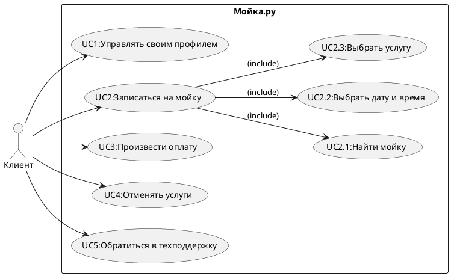

### Проект автомоек

### 1.User Story
1.Я как владелец автомобиля хочу записаться на автомойку онлайн чтобы сэкономить время и не ждать в очереди. <br>
2.Я как водитель такси хочу воспользоваться экспресс-мойкой чтобы автомобиль быстро был чистым и готовым к следующему заказу.<br>
3.Я как клиент автомойки хочу видеть доступные тарифы и услуги на сайте или в приложении чтобы выбрать подходящий вариант.<br>
4.Я как владелец автомобиля хочу получить напоминание о предстоящей записи чтобы не забыть приехать на автомойку вовремя.<br>
5.Я как постоянный клиент автомойки хочу получать скидки и бонусы за регулярные посещения чтобы экономить деньги на услугах мойки.<br>
6.Я как владелец автомобиля хочу заказать антидождевую обработку стекол чтобы улучшить видимость во время дождя и повысить безопасность.<br>
7.Я как клиент автомойки хочу иметь возможность оплатить услугу онлайн чтобы сократить время ожидания на месте.<br>
8.Я как клиент автомойки хочу получить услугу выездной мойки чтобы не тратить время на поездку и получить чистый автомобиль у дома.<br>
9.Я как владелец внедорожника хочу воспользоваться услугой мойки днища автомобиля чтобы защитить его от коррозии и грязи.<br>
10.Я как родитель с маленькими детьми хочу находиться в комфортной зоне ожидания с Wi-Fi и напитками чтобы спокойно дождаться завершения мойки автомобиля.<br>

### 2.Use Case diagram


<details>
  <summary>Код Use Case</summary>
  


</details>

#### Сценарии использования

#### UC1: Управлять своим профилем
Участники:
Клиент

Предусловия:
Клиент зарегистрирован в системе и вошел в аккаунт.

Условие для запуска сценария:
Клиент выбирает опцию управления профилем.

Базовый сценарий:

Клиент открывает раздел "Профиль".
Клиент редактирует свои данные (имя, фамилию, email, телефон).
Клиент сохраняет изменения.
Система подтверждает успешное обновление профиля.
Альтернативный сценарий:

Клиент вводит некорректные данные (например, невалидный email).
Система выводит сообщение об ошибке и предлагает исправить данные.
Клиент исправляет данные и сохраняет изменения.
Система подтверждает успешное обновление профиля.
Признак успешности:
Профиль клиента успешно обновлен.

#### UC2: Записаться на мойку
Участники:
Клиент

Предусловия:
Клиент зарегистрирован в системе и вошел в аккаунт.

Условие для запуска сценария:
Клиент выбирает опцию записи на мойку.

Базовый сценарий:

Клиент выбирает опцию "Записаться на мойку".
Система предлагает найти мойку (UC2.1).
Клиент выбирает дату и время записи (UC2.2).
Клиент выбирает услугу или несколько услуг (UC2.3).
Клиент подтверждает запись.
Система подтверждает успешную запись на мойку.
Альтернативный сценарий:

#### Клиент не может найти подходящую мойку (UC2.1).
Система предлагает клиенту вернуться на главный экран.
Или:

#### Выбранное время недоступно (UC2.2).
Система предлагает выбрать другое время.
Признак успешности:
Запись на мойку успешно создана.

#### UC3: Произвести оплату
Участники:
Клиент

Предусловия:
Клиент записался на мойку.

Условие для запуска сценария:
Клиент выбирает опцию оплаты услуги.

Базовый сценарий:

Клиент открывает раздел оплаты.
Система отображает сумму и доступные способы оплаты.
Клиент выбирает способ оплаты (например, карта или электронный кошелек).
Клиент вводит необходимые данные.
Система подтверждает успешное выполнение платежа.
Альтернативный сценарий:

Клиент выбирает способ оплаты, но вводит некорректные данные.
Система выводит сообщение об ошибке.
Клиент вводит корректные данные.
Платеж успешно проводится.
Признак успешности:
Услуга успешно оплачена, подтверждение оплаты отображено.

#### UC4: Отменять услуги
Участники:
Клиент

Предусловия:
Клиент записался на мойку.

Условие для запуска сценария:
Клиент выбирает услугу для отмены.

Базовый сценарий:

Клиент открывает раздел "Мои записи".
Клиент выбирает услугу для отмены.
Система спрашивает подтверждение отмены.
Клиент подтверждает отмену.
Система отменяет запись и отправляет уведомление.
Альтернативный сценарий:

Клиент открывает раздел "Мои записи".
Система не позволяет отменить запись (например, время уже истекло).
Клиент получает соответствующее уведомление.
Признак успешности:
Услуга успешно отменена, клиент получает уведомление.

#### UC5: Обратиться в техподдержку
Участники:
Клиент

Предусловия:
Клиент зарегистрирован в системе и вошел в аккаунт.

Условие для запуска сценария:
Клиент выбирает опцию обращения в техподдержку.

Базовый сценарий:

Клиент открывает раздел "Техподдержка".
Клиент выбирает тему обращения и вводит описание проблемы.
Клиент отправляет запрос.
Система подтверждает успешное создание обращения и присваивает номер запроса.
Альтернативный сценарий:

Клиент не указывает обязательные данные (тема обращения или описание).
Система выводит сообщение об ошибке и предлагает заполнить обязательные поля.
Клиент корректирует данные и отправляет запрос.
Система подтверждает успешное создание обращения.
Признак успешности:
Запрос в техподдержку успешно создан.

### 3.ERD


<details>
  <summary>Код ERD</summary>
  
```plaintext

Table Client {
  client_id int [pk]
  first_name varchar
  last_name varchar
  email varchar
  phone varchar
  password varchar
}

Table Profile {
  profile_id int [pk]
  client_id int [ref: > Client.client_id]
  created_at datetime
  updated_at datetime
}

Table CarWash {
  car_wash_id int [pk]
  name varchar
  address varchar
  rating float
  contact_phone varchar
}

Table Service {
  service_id int [pk]
  service_name varchar
  description text
  price decimal
  duration int
}

Table Booking {
  booking_id int [pk]
  client_id int [ref: > Client.client_id]
  car_wash_id int [ref: > CarWash.car_wash_id]
  booking_datetime datetime
  status varchar
  total_price decimal
}

Table SelectedServices {
  booking_id int [ref: > Booking.booking_id]
  service_id int [ref: > Service.service_id]
  quantity int
}

Table Payment {
  payment_id int [pk]
  booking_id int [ref: > Booking.booking_id]
  payment_datetime datetime
  amount decimal
  payment_status varchar
  payment_method varchar
}

Table Support {
  support_id int [pk]
  client_id int [ref: > Client.client_id]
  request_topic varchar
  issue_description text
  created_at datetime
  request_status varchar
}

```

</details>

### C4 Model

#### Level 1: System Context


<details>
  <summary>Код C1</summary>
  
```plaintext

@startuml
!include https://raw.githubusercontent.com/plantuml-stdlib/C4-PlantUML/master/C4_Context.puml

LAYOUT_WITH_LEGEND()

' System Context
System_Boundary(c1, "Автомойка") {

    System(auto_wash, "Автомойка", "Система управления автомойкой", "Управляет бронированиями, услугами, платежами и пользователями")

}

Person(client, "Клиент", "Пользователь, заказывающий услуги автомойки")
Person(admin, "Администратор", "Сотрудник автомойки, управляющий системой")


System_Ext(payment_system, "Платежная система", "Обрабатывает платежи")
System_Ext(notification_system, "Система уведомлений", "Отправляет уведомления пользователям")
System_Ext(accounting_system, "Система учета", "Система финансового учета")
System_Ext(map_system, "Картографическая система", "Предоставляет информацию о местоположении")


Rel(client, auto_wash, "Запись на мойку, просмотр цен, оплата, отслеживание статуса, обращение в техподдержку", "HTTPS")
Rel(admin, auto_wash, "Управление автомойками, услугами, тарифами, расписанием, просмотр отчетов", "HTTPS")

Rel(auto_wash, payment_system, "Обработка платежей", "REST")
Rel(auto_wash, notification_system, "Отправка уведомлений", "REST")
Rel(auto_wash, accounting_system, "Получение данных по прибыли", "REST")
Rel(auto_wash, map_system, "Получение данных о местоположении автомоек", "REST")

@enduml


```

</details>

#### Level 2: Container Diagram


<details>
  <summary>Код C2</summary>
  
```plaintext

@startuml
!include https://raw.githubusercontent.com/plantuml-stdlib/C4-PlantUML/master/C4_Container.puml

LAYOUT_WITH_LEGEND()

' Containers
System_Boundary(c1, "Автомойка") {
    Container(web_app, "Веб-приложение", "Java, Spring Boot", "Предоставляет интерфейс для клиентов и администраторов")
    Container(mobile_app, "Мобильное приложение", "React Native", "Предоставляет интерфейс для клиентов")
    Container(api, "API-сервис", "Java, Spring Boot", "Предоставляет API для веб- и мобильных приложений")
    ContainerDb(db, "База данных", "PostgreSQL", "Хранит данные пользователей, автомоек, бронирований и т.д.")
   Container(notification_service, "Сервис уведомлений", "Node.js", "Отправляет уведомления пользователям")
}

' External Systems
System_Ext(payment_system, "Платежная система", "Сторонняя система для обработки платежей")
System_Ext(accounting_system, "Система учета", "Сторонняя система для финансовой отчетности")
System_Ext(map_system, "Картографическая система", "Сторонняя система для получения информации о местоположении")
'Person
Person(client, "Клиент", "Пользователь, заказывающий услуги автомойки")
Person(admin, "Администратор", "Сотрудник автомойки, управляющий системой")


' Relationships
Rel(client, mobile_app, "Использует для заказа услуг")
Rel(client, web_app, "Использует для заказа услуг и управления профилем")
Rel(admin, web_app, "Использует для управления системой")
Rel(mobile_app, api, "Использует API")
Rel(web_app, api, "Использует API")
Rel(api, db, "Использует для хранения данных", "JDBC")
Rel(api, payment_system, "Использует для обработки платежей", "REST")
Rel(api, notification_service, "Использует для отправки уведомлений", "REST")
Rel(notification_service, notification_system, "Отправка уведомлений", "REST")
Rel(api, accounting_system, "Получает данные для финансовой отчетности", "REST")
Rel(api, map_system, "Получает данные о местоположении автомоек", "REST")
@enduml


```

</details>

### Sequence Diagrams
#### Сценарий 1: Клиент бронирует автомойку


<details>
  <summary>Код cценарий 1</summary>
  
```plaintext

@startuml
autonumber

participant "Клиент" as client
participant "Мобильное приложение" as mobile_app
participant "API-сервис" as api
participant "База данных" as db
participant "Платежная система" as payment_system
participant "Сервис уведомлений" as notification_service

activate client
    client -> mobile_app : Выбирает автомойку, услуги, дату и время
    activate mobile_app
        mobile_app -> api : Запрос на бронирование
        activate api
            api -> db : Проверка доступности времени
            activate db
                db --> api : Доступность подтверждена
            deactivate db
            api -> db : Запись данных бронирования
            activate db
                db --> api : Бронирование сохранено
            deactivate db
            api -> payment_system : Перенаправление на оплату
            activate payment_system
                payment_system --> api : Успешная оплата
            deactivate payment_system
             api -> db : Обновление статуса бронирования на "оплачено"
             activate db
                db --> api : Статус бронирования обновлен
            deactivate db
             api -> notification_service : Запрос на отправку уведомления
             activate notification_service
                notification_service --> api : Уведомление отправлено в систему уведомлений
              deactivate notification_service
            api --> mobile_app : Бронирование подтверждено
        deactivate api
    mobile_app --> client : Показ подтверждения бронирования
deactivate mobile_app
deactivate client
@enduml


```

</details>
